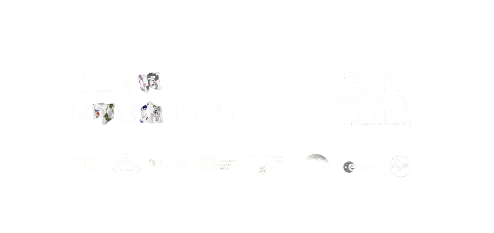

<br/>
<div align="center">
<a href="h[ttps://github.com/ShaanCoding/makeread.me](https://github.com/Ray0716/teenhacks-2025)">
 
</a>
<h1 align="center">Zero Robotics Competition ICPS Team Code 2025</h3>
<p align="center">
Description
<br/>
<br/>
<a href="https://google"><strong>Explore the nonexistent docs »</strong></a>
<br/>
<br/>

</p>
</div>


<div align="center">
  


  

</div>

## Table of Contents

- [Table of Contents](#table-of-contents)
- [About The Project](#about-the-project)
  - [Built With](#built-with)
- [Getting Started](#getting-started)
  - [Prerequisites](#prerequisites)
  - [Installation](#installation)
  - [Features](#features)
  - [Notes](#notes)
- [Roadmap](#roadmap)
- [Contributing](#contributing)
- [License](#license)
- [Contact](#contact)
- [Acknowledgments](#acknowledgments)

## About The Project


text


### Built With

This project was built with the following technologies:

* Python
* pyautogui
* opencv
* mediapipe

## Getting Started

Below are instructions on how to run this project locally.


### Installation

Please follow the following steps for successful installation:

1. **Clone the Repository:** Get started by cloning the repository to your local machine.

   ```
   https://github.com/Ray0716/teenhacks-2025
   ```

2. **Initialize virtual environment:** Please run this command :

   ```sh
   python -m venv myenv

   ```

3. **Activate venv:** Run this command :

   ```sh
   source myenv/bin/activate
   ```

4. **Install packages:**

   - Run the following:
     ```sh
     pip install opencv-python && pip install pyautogui && pip install medaipipe
     ```


   Now, your AirControl App should be successfully up and running!


### Features

* 1
* 2
* 3

### Notes

* When blablabal
* also blablabal

## Roadmap

The roadmap includes both completed and future goals. Here&#39;s what we have accomplished and looking forward to:

- [x] stuff
- [ ] not stuff

We continue our commitment to improving and expanding the capabilities of makeread.me to provide an efficient and seamless AirControl experience to our users.

See the [open issues](https://github.com/Ray0716/teenhacks-2025/issues) for a full list of proposed features (and known issues).

## Contributing

Contributions are what make the open source community such an amazing place to learn, inspire, and create. Any contributions you make are **greatly appreciated**.

If you have a suggestion that would make this better, please fork the repo and create a pull request. You can also simply open an issue with the tag &quot;enhancement&quot;.
Don&#39;t forget to give the project a star! Thanks again!

## License

Distributed under the Mozilla Public License 2.0 License. See [Mozilla Public License 2.0 License](https://github.com/ShaanCoding/makeread.me/blob/main/LICENSE.md) for more information.

## Contact

If you have any questions or suggestions, feel free to reach out to us:
